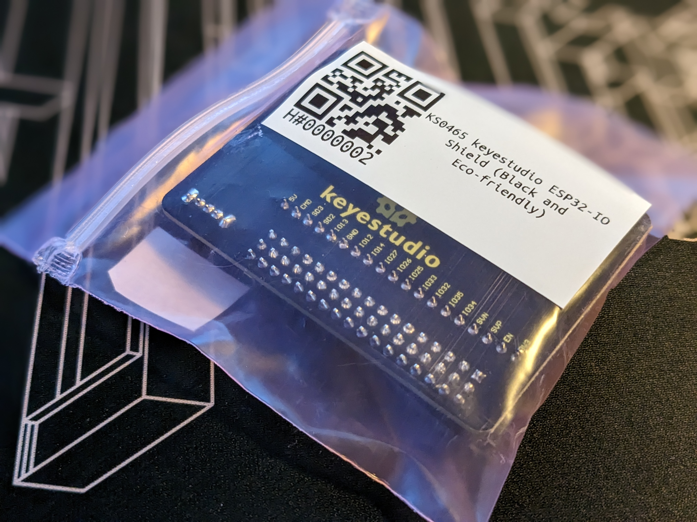

# make-qrcode-label
Small wrapper scripts i use to generate, validate and print QR codes on a Brother QL-810W

## generate-qr-from-ods.sh
Will read from Openoffice ODS (se `example.ods`) and run `qr-with-text.sh` on lines, ignoring those already in `01_Output`

## qr-with-text.sh
Takes a number (ID) and text as input. Generates QR code with label.

## make-qr-matrix.sh
Generates a matrix of QR codes.

